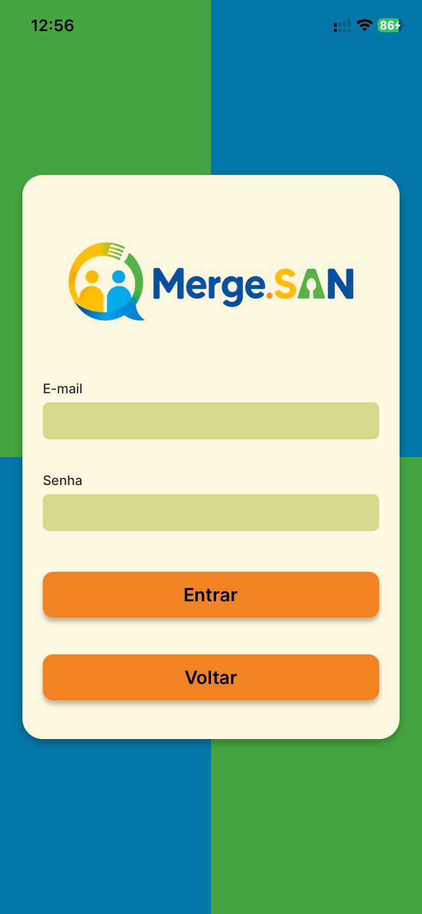
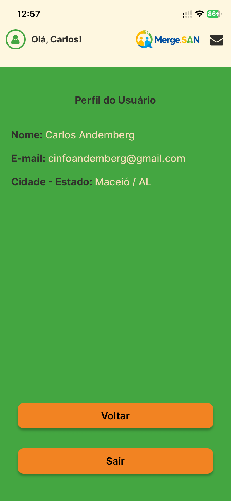

# 🥗 Projeto Final – Gestão da Qualidade de Software

 

## 1. Identificação do Projeto
- **Nome do projeto:** Merge.SAN - Rede de Integração para Promoção de Segurança Alimentar e Nutricional
- **Integrantes da equipe:** Carolina da Silva Menezes e Carlos Andemberg da Silva

---

## 2. Descrição do Projeto
- **Apresentação resumida:** Uma plataforma digital de cidadania alimentar, em formato de aplicativo móvel, que conecta de forma rápida pessoas em situação de insegurança alimentar a serviços públicos e iniciativas sociais da sua região.
- **Objetivo do sistema:** Enfrentar a insegurança alimentar, solucionando a dificuldade no mapeamento, identificação e acompanhamento de pessoas e famílias em situação de vulnerabilidade.
- **Público-alvo:** Pessoas em vulnerabilidade (mulheres, mães solo, pessoas negras, LGBTQIA+, povos tradicionais e pessoas em situação de rua), agentes comunitários, assistentes sociais, organizações públicas e administradores.

---

## 3. Requisitos Funcionais

* **RF01:** Permitir o cadastro rápido da pessoa vulnerável com dados básicos diretamente pelo celular.
* **RF02:** Permitir que o usuário envie sua localização atual ou endereço (georreferenciamento).
* **RF03:** Permitir que agentes comunitários registrem novos casos, anexem fotos, documentos e relatórios sociais.
* **RF04:** Permitir que organizações recebam encaminhamentos, atualizem status de atendimento e cadastrem programas.
* **RF05:** Analisar dados socioeconômicos via Inteligência Artificial (IA) para identificar nível de risco e sugerir automaticamente serviços adequados.

---

## 4. Requisitos Não Funcionais

* **RNF01:** Interface e UX prototipadas e validadas através da ferramenta Figma.
* **RNF02:** O sistema deve ser um aplicativo multiplataforma desenvolvido em React Native (com Expo) garantindo alto desempenho.
* **RNF03:** Garantir a segurança, criptografia e auditoria de todos os dados sensíveis cadastrados.
* **RNF04:** Integração eficiente com APIs externas para mapas e IA generativa.

---

## 5. Tecnologias Utilizadas

- **Linguagens de programação:** TypeScript, JavaScript
- **Frameworks:** React Native, Expo, Expo Router
- **Banco de dados e Autenticação:** Firebase (Firestore DB, Authentication)
- **Ferramentas e bibliotecas relevantes:** Google Generative AI (Gemini API para IA), React Native Maps (geolocalização), Jest e React Native Testing Library (testes automatizados).

---

## 6. Avaliação dos Requisitos

| Requisito | Status | Observações |
| :---: | :--- | :--- |
| **RF01** | ✅ Implementado | Cadastro simplificado desenvolvido no app. |
| **RF02** | ✅ Implementado | Funcionalidade de mapa integrada com React Native Maps. |
| **RF03** | ⚠️ Parcial | Limitação de tempo para anexação robusta de documentos. |
| **RF04** | ✅ Implementado | Cadastro e atualização de organizações está no roadmap final. |
| **RF05** | ✅ Implementado | Integração feita usando Google Gemini API no código. |
| **RNF01** | ✅ Implementado | Design validado no Figma. |
| **RNF02** | ✅ Implementado | Feito com React Native e Expo. |
| **RNF03** | ✅ Implementado | Segurança garantida pelas regras de autenticação Firebase. |
| **RNF04** | ✅ Implementado | Uso de React Native Maps e Google AI. |

---

## 7. Evidências

Abaixo estão as capturas de tela das principais funcionalidades desenvolvidas no aplicativo. O layout foi otimizado para não prejudicar a leitura do documento.

### 🚀 1. Tela Inicial e Boas-vindas
A tela inicial apresenta a identidade visual do Merge.SAN, oferecendo um acesso direto e acolhedor para o login ou cadastro, direcionando o usuário ou a organização.

  

### 📱 2. Acesso e Autenticação
O aplicativo conta com uma tela de entrada intuitiva e formulários otimizados para um cadastro sem atritos, abrangendo tanto pessoa física (CPF) quanto organizações (CNPJ).

  
  
  

### 🗺️ 3. Navegação e Exploração (Tela Principal)
Na tela principal, o usuário interage com um mapa integrado que exibe pontos de interesse (CRAS, CREAS, ONGs). Há suporte para menus de filtragem e uma barra de pesquisa inteligente.

  
  
  

### 👤 4. Interação com os Serviços
A visualização detalhada de pontos no mapa e a tela de perfil do usuário, permitindo gerenciar informações e solicitar encaminhamentos.

  
  

---

## 8. Repositório Git
- **Link do Projeto:** [Acessar Repositório no GitHub](https://github.com/carlos-andemberg/Merge.SAN) *(Atualizado conforme a última entrega)*

---

## 9. Testes Realizados

**Estratégia de Testes:** Foram aplicados testes automatizados focados no comportamento da interface (UI) e integração de módulos críticos do aplicativo. Os testes buscam garantir que componentes reajam adequadamente a interações do usuário e propriedades visuais, utilizando renderização simulada.

**Ferramenta Utilizada:** Jest + React Native Testing Library

### Tabela de Cobertura de Testes

| Tipo | Objetivo do Teste | Resultado Esperado | Obtido |
| :--- | :--- | :--- | :---: |
| **Unidade 1** | Validar exibição do título no componente `Botao` | O botão exibe o título "Salvar" | ✅ Passou |
| **Unidade 2** | Validar evento de clique no componente `Botao` | A função onPress é chamada após o clique | ✅ Passou |
| **Unidade 3** | Validar exibição da label no componente `Campo` | Exibe a label corretamente na tela | ✅ Passou |
| **Unidade 4** | Validar se o `Campo` repassa propriedades | O placeholder do TextInput aparece | ✅ Passou |
| **Unidade 5** | Validar placeholder do componente `Pesquisa` | Exibe o texto padrão "Pesquisar..." | ✅ Passou |
| **Unidade 6** | Atualizar estado ao digitar no componente `Pesquisa` | O valor do input muda para o texto digitado | ✅ Passou |
| **Unidade 7** | Exibir sugestões ao focar no componente `Pesquisa` | A lista de recomendações fica visível | ✅ Passou |
| **Unidade 8** | Filtrar resultados no componente `Pesquisa` | Exibe apenas o local correspondente ao filtro | ✅ Passou |
| **Unidade 9** | Busca vazia no componente `Pesquisa` | Exibe mensagem de "Nenhum local encontrado." | ✅ Passou |
| **Unidade 10** | Seleção de item no componente `Pesquisa` | onSelect é chamado corretamente com o ID | ✅ Passou |
| **Integração 1**| Fluxo de validação de dados em branco na tela Login | Exibe Alerta bloqueando tentativa de login | ✅ Passou |
| **Integração 2**| Renderização correta da navbar logada (Cabecalho) | Inicializa corretamente com perfil do usuário | ✅ Passou |
